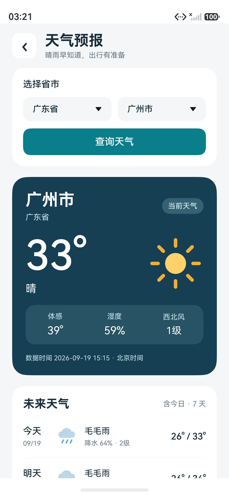
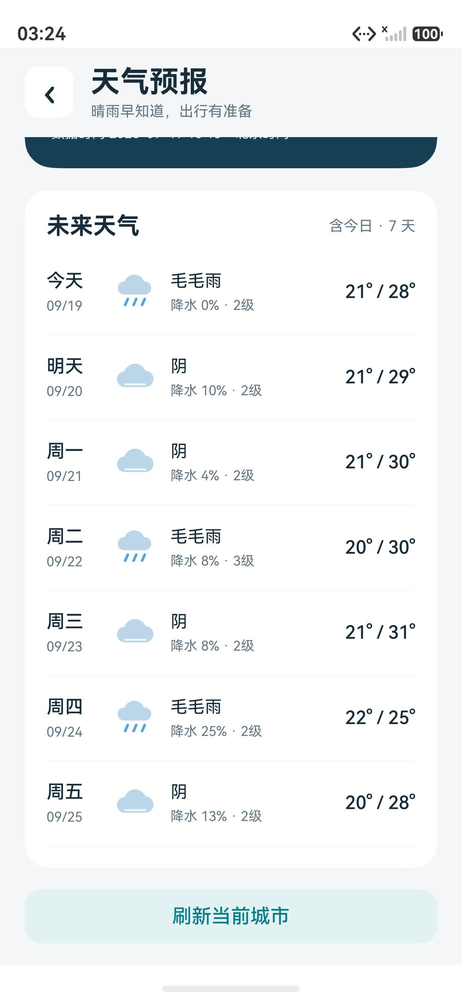

# 天气预报 · 2026-09-18 课程任务

任务 04：通过选择省、市查询当前天气和未来几天的预报，提供加载、失败、无网络提示和重试。提交期限为 2026 年 9 月 24 日，本文保存在项目根目录 `doc`。

## 使用方法

首页点击“天气预报”，或从任务列表 → 任务 04 → 进入任务应用打开。第一次默认查询广州，以后记住上次查询城市。先选择省级地区，再选择城市，点击“查询天气”。省份变化时，城市列表和选择值一起更新。

- 覆盖 34 个省级地区、392 个城市及行政区域，包含直辖市、自治州、部分省直辖县市及港澳台地区。内置地理目录，无需联网加载选择器，也不申请定位权限。
- 当前卡片显示城市、温度、天气状况、体感温度、相对湿度、风向、风力等级和数据时间。
- 展示包含今日在内的七日天气、最低 / 最高温、每日最大降水概率及最大风力。日期统一按北京时间解释。
- 页面底部“刷新当前城市”刷新当前结果对应的城市；“重新尝试”重试上次提交的查询。选择器中的修改需点击“查询天气”才生效。
- 最近 12 个查询城市保存成功结果。缓存最多保留 24 小时供显示，始终标注“历史缓存”和过时提示；每次打开页面仍会联网更新。超过 24 小时不显示旧结果。
- 可滚动页面适配窄屏。天气图标为项目自绘 SVG，无需下载图片。

## 数据与网络

使用 [Open-Meteo Forecast API](https://open-meteo.com/en/docs)，HTTPS GET，无 API Key，适用于本课程非商业学习用途。当前天气是模型估算值，并非本机传感器或逐站实况；界面已说明。数据时间来自服务响应，不用查询时间代替。

请求参数固定为 `timezone=Asia/Shanghai`、`temperature_unit=celsius`、`wind_speed_unit=ms`、`forecast_days=7`，坐标取自所选城市。请求当前温度、湿度、体感、昼夜、天气代码、10 米风速 / 风向，以及每日天气代码、最高最低温、降水概率、最大风速。页面将 WMO 天气代码转换为中文，风速转换为蒲福等级，温度取整；缺失可选值显示“—”，不会把 `null` 当作 0。

`WeatherHttpClient` 使用 HarmonyOS Network Kit 的 `http.createHttp()`，连接超时 6 秒、读取超时 10 秒、响应上限 128 KiB。每次查询独立创建请求，结束后 `destroy()`。关闭页面或新查询会销毁前一个请求，并用递增序号防止旧请求的成功 / 失败回调覆盖新城市。

声明 `ohos.permission.INTERNET` 和 `ohos.permission.GET_NETWORK_INFO`。网络检测失败时仍尝试 HTTP；无默认网络、HTTP 429 / 服务错误、请求超时、连接失败和数据异常使用不同友好提示，均可重试。网络异常没有伪造天气或回退为演示数值。

## 结构与生命周期

| 文件 | 职责 |
| --- | --- |
| `entry/src/main/ets/pages/Weather.ets` | ArkUI 页面、两个展示组件、省市联动和用户操作 |
| `entry/src/main/ets/services/WeatherHttpClient.ets` | HTTPS、网络检测、错误映射与请求释放 |
| `entry/src/main/ets/model/WeatherData.ets` | DTO、校验、天气代码 / 温度 / 风力 / 日期转换 |
| `entry/src/main/ets/model/WeatherController.ets` | 加载 / 成功 / 失败 / 离线状态、缓存策略、竞态防护 |
| `entry/src/main/ets/model/WeatherStore.ets` | 独立 Preferences 文件 `course_weather_v1`，最近城市和缓存 |
| `entry/src/main/ets/model/WeatherCities.ets` | 离线省市名称和查询坐标 |
| `scripts/test-weather.cjs` | 对真实 ETS 源码的本地自动化测试及可选真实 API 检查 |
| `entry/src/ohosTest/ets/test/WeatherFlow.test.ets` | 原生 Hypium / UiTest 天气页面流程测试 |

数据流：页面事件 → Controller → 网络接口 / 存储接口 → 校验后的 WeatherReport → 整体替换 WeatherViewState → ArkUI 更新。UI 不直接创建 HTTP 请求，也不解析 JSON。

`onPageShow` 创建控制器并查询；`onPageHide` 和 `aboutToDisappear` 取消请求。存储失败不会遮挡成功天气，页面会单独提示保存失败。损坏缓存可在下次成功查询后恢复。天气功能不会读取或修改个人资料、电子名片。

## 验证记录（2026-09-19）

环境：Windows、DevEco Studio 6.1、HarmonyOS 6.1.1 / API 24、Pura 90 模拟器。

| 检查 | 实际结果 |
| --- | --- |
| 应用 ArkTS 编译与 HAP 打包 | 通过；HAP 未签名，已安装模拟器 |
| ohosTest 测试包构建 | 通过；已安装模拟器 |
| 天气模型 / HTTP / Controller / Preferences | 32 / 32 项通过；运行真实 ETS 源码，以隔离适配器替换平台 API |
| 真实 HTTPS 接口 | 广州、北京均返回有效当前天气和 7 天预报；连同上述测试共 33 / 33 项通过 |
| 原生设备 UI | `WeatherUi.opensQueriesRefreshesForecastAndReturns` 1 / 1 通过，包含进入、查询、天气字段、七日预报、刷新和返回 |
| 省市切换与持久化 | 广州 → 深圳 → 北京的设备交互检查及进程重启重读 |
| 既有计算器本地回归 | 26 项计算测试、8 项语音服务回调测试通过 |

异常用例覆盖：无网络、查询中断网、超时、DNS / 连接失败、429 / 503、非字符串响应、损坏 JSON、空温度、缺失可选字段、数组长度不一致、无效日期、时区不符、未知天气代码、0 值与负温度、错误 / 过期 / 未来时间缓存、存储失败、12 城市容量、旧请求晚到、页面退出、重试恢复。错误路径通过可控平台适配器验证；没有在本次设备测试中人为关闭系统网络。

运行本地测试：

```powershell
& 'D:\HUAWEI\DevEco Studio\tools\node\node.exe' scripts/test-weather.cjs --deveco-home 'D:\HUAWEI\DevEco Studio'
# 增加广州、北京真实联网检查：
& 'D:\HUAWEI\DevEco Studio\tools\node\node.exe' scripts/test-weather.cjs --deveco-home 'D:\HUAWEI\DevEco Studio' --live
```

构建和运行设备测试（需要已启动、解锁且联网的 API 24 模拟器）：

```powershell
.\scripts\build.ps1 -DevEcoHome 'D:\HUAWEI\DevEco Studio'
.\scripts\build.ps1 -DevEcoHome 'D:\HUAWEI\DevEco Studio' -Target ohosTest
$taskHdc = 'D:\HUAWEI\DevEco Studio\sdk\default\openharmony\toolchains\hdc.exe'
& $taskHdc -t 127.0.0.1:5555 install entry/build/default/outputs/default/entry-default-unsigned.hap
& $taskHdc -t 127.0.0.1:5555 install entry/build/default/outputs/ohosTest/entry-ohosTest-unsigned.hap
& $taskHdc -t 127.0.0.1:5555 shell aa test -b cn.gdut.iotsoft.cdz3124001415 -m entry_test -s unittest OpenHarmonyTestRunner -s class WeatherUi -s timeout 180000 -w 240
```

## 数据来源与维护

- 天气由 [Open-Meteo](https://open-meteo.com/) 提供，数据采用 [CC BY 4.0](https://creativecommons.org/licenses/by/4.0/)，[许可说明](https://open-meteo.com/en/licence)。页面有可打开的来源 / 许可链接；中文名称、风力等级和四舍五入属于本项目展示转换。
- 省市名称和坐标事实摘自 [QWeather LocationList](https://github.com/qwd/LocationList) 的 `China-City-List v202506200`（2026-09-19 下载），按省 / 上级行政区域分组，优先使用同名城市或行政中心坐标。天气查询未调用和风天气 API。此目录用于天气地点选择，不宣称是实时行政区划库。
- 运行 `python scripts/update-weather-cities.py` 可重新生成目录；也可传入下载好的 CSV 路径。生成文件内记录原始文件 SHA-256。上游数据变化后需复核城市数量和坐标再提交。
- 平台接口契约按本机 API 24 SDK 中 `@ohos.net.http.d.ts`、`@ohos.net.connection.d.ts` 和 Preferences 类型声明实现。真机使用需要自己的开发签名。

## 设备截图

截图仅包含天气功能，无个人资料或联系人。




