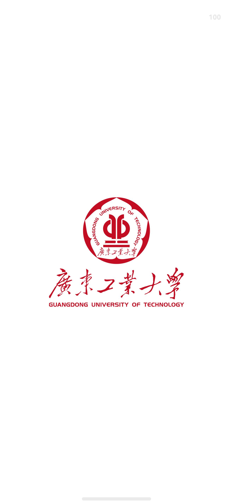
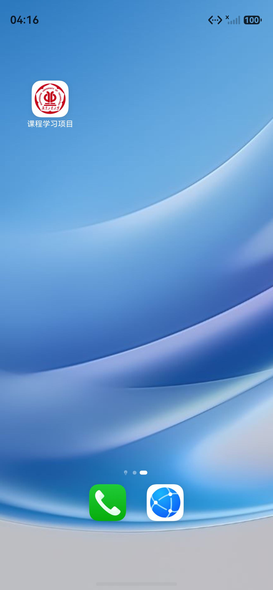

# 启动页与校徽图标

2026-09-09：按要求增加白底图片启动页，显示约 1 秒后进入课程首页，应用图标改为校徽。

## 资源

- `entry/src/main/resources/base/media/launch_logo.png`：用户提供的 `footer-logo2.png` 原文件，保留透明通道，未改动图片内容。两个文件的 SHA-256 均为 `5AED3D32D52ECFEF986DA2737D7F812813B538E485035A3FE822CC35C3F70DB2`。
- `AppScope/resources/base/media/school_icon.png` 与 `entry/src/main/resources/base/media/school_icon.png`：通过内置 image_gen 基于上方校徽制作的白底图标，去除下方校名横排文字。[处理提示词](branding-image-prompt.txt)。
- 应用、主 Ability 和系统启动窗口的资源引用已更新。
- 基础与深色模式的系统启动窗口背景均设为白色，避免深色模式下先出现黑底。

## 显示与跳转

`EntryAbility` 首次创建窗口时加载 `pages/Splash`。启动页用白底居中展示完整图片，等图片解码并经过一帧绘制后计时 1000 毫秒，再通过 `replaceUrl` 进入首页。启动页不会留在返回栈中；离开页面会清理计时器。从后台恢复时保留原有页面。

## 验证

主应用与设备测试包编译成功。Pura 90 / HarmonyOS 6.1.1（API 24）模拟器中已确认桌面图标、白底透明图渲染和自动跳转。

加入启动页后重新运行全部设备测试：个人资料测试 1 项、名片存储测试 5 项、名片界面完整操作测试 1 项，全部通过。

```text
Tests run: 7, Failure: 0, Error: 0, Pass: 7, Ignore: 0
TestFinished-ResultCode: 0
```

两次冷启动日志中的计时分别为 1014 毫秒和 1016 毫秒：

```text
16:11:03.336  Launch image rendered; starting 1000 ms display.
16:11:04.350  Entering the course application.
16:16:33.519  Launch image rendered; starting 1000 ms display.
16:16:34.535  Entering the course application.
```

| 白底启动页 | 桌面校徽图标 |
| --- | --- |
|  |  |
