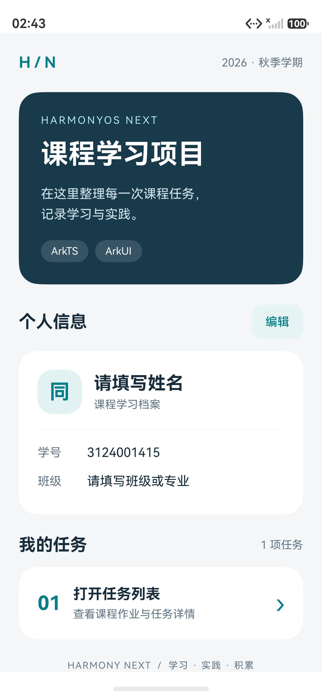
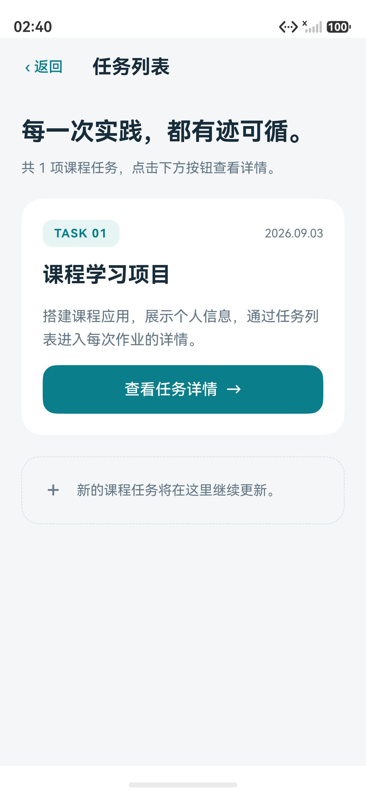
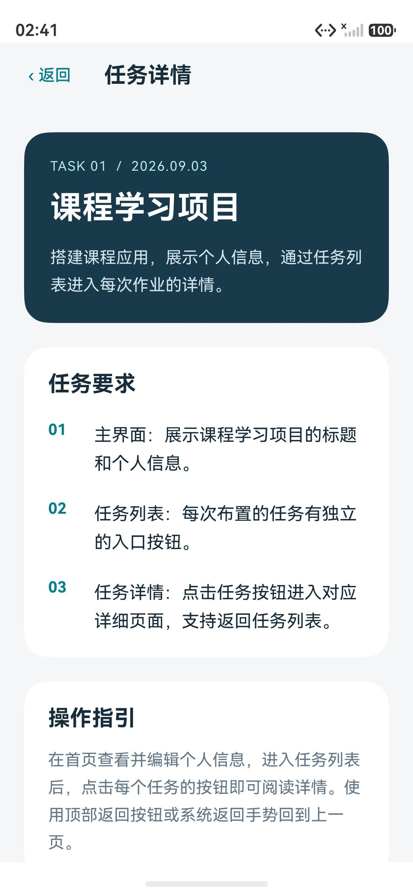
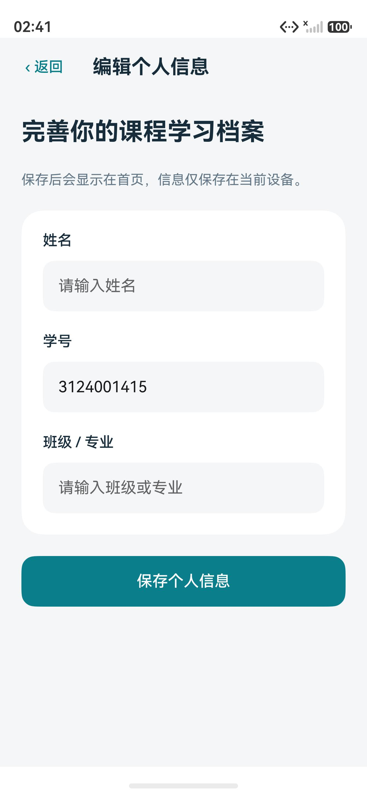

# 验证记录

验证日期：2026-09-07。工程使用 DevEco Studio 6.1 工具链、HarmonyOS 6.1.1（API 24）SDK，运行设备为本机 Pura 90 模拟器（1320 × 2856）。

## 编译和运行

- `scripts/build.ps1`：BUILD SUCCESSFUL，ArkTS 无错误和告警。
- 生成 `entry-default-unsigned.hap`，通过 HDC 在模拟器安装成功。
- `EntryAbility` 启动成功，首页可见，未出现加载错误。
- 现有工程未配置签名，因此构建保留“跳过签名”的提示。本次未修改包名或证书配置，未验证真机签名安装。

## 页面验证

| 检查 | 结果 |
| --- | --- |
| 首页展示项目标题、学号和个人信息编辑入口 | 通过 |
| 首页按钮进入任务列表 | 通过 |
| 任务 01 按钮打开对应标题与任务要求 | 通过 |
| 详情页顶部返回回到任务列表 | 通过 |
| 详情页系统返回回到任务列表 | 通过 |
| 列表顶部返回回到首页 | 通过 |
| 首页编辑入口打开姓名、学号、班级表单 | 通过 |
| 空表单提交显示完整填写提示 | 通过 |
| 首页、任务、详情、资料页截图检查 | 通过 |

姓名与班级尚未预填；首页明确提示填写，可在“编辑个人信息”中补充。输入法首次启动存在独立的使用提示，本次未替用户确认该提示，因此未通过软键盘完成有效表单提交的端到端测试。存储服务的中文保存和磁盘重读由下述设备测试验证。

## 设备存储测试

文件：`entry/src/ohosTest/ets/test/Ability.test.ets`。

测试 `CourseProfilePersistence.savesChineseProfileAndReloadsFromDisk` 使用 UIAbility 上下文，写入中文姓名、学号和班级，等待 flush，移除内存缓存，再次从磁盘读取并检查三个字段。测试结束恢复原资料。

实际结果：

```text
Tests run: 1, Failure: 0, Error: 0, Pass: 1, Ignore: 0
```

## 模拟器截图

| 首页 | 任务列表 |
| --- | --- |
|  |  |

| 任务详情 | 个人信息编辑 |
| --- | --- |
|  |  |
