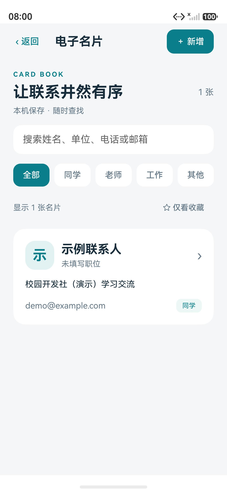
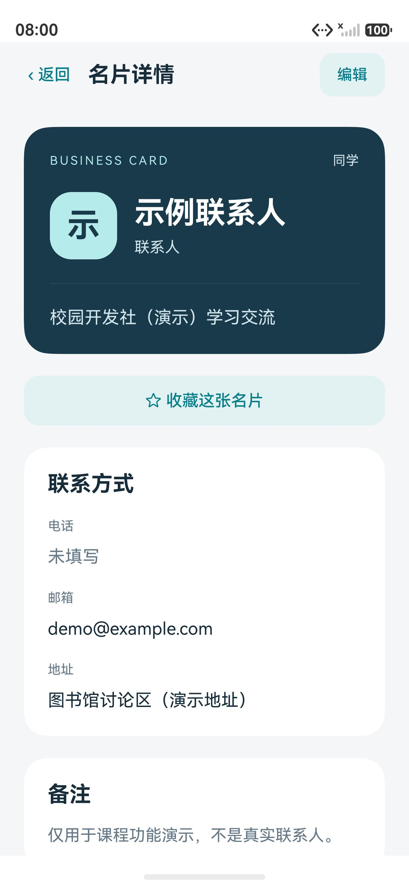
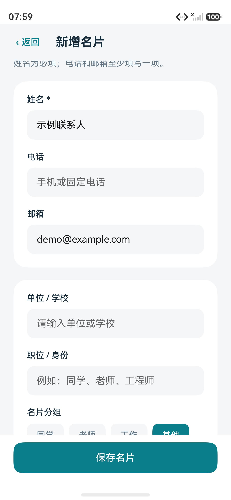
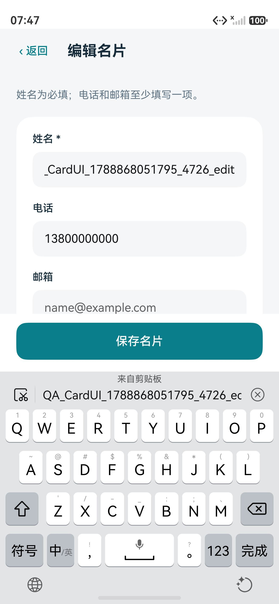
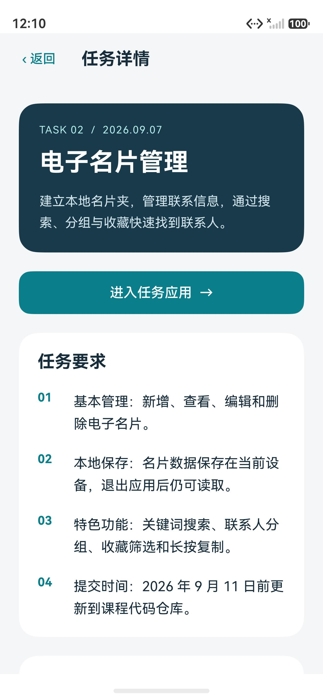
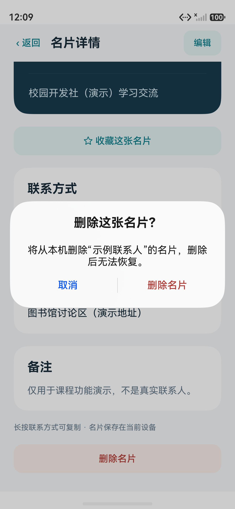

# 验证记录

验证日期：2026-09-08 至 2026-09-09。工程使用 DevEco Studio 6.1 工具链、HarmonyOS 6.1.1（API 24）SDK，在 Pura 90 手机模拟器上运行。

## 构建与安装

- 主应用和 `ohosTest` 测试包均为 `BUILD SUCCESSFUL`。
- 主应用 ArkTS 编译无错误和告警；测试包保留 SDK 对部分 UiTest 异步调用的静态异常提示，实际执行的异常由测试框架统计。
- 两个 HAP 均通过 HDC 安装，应用能够正常启动。
- 工程未配置签名，构建保留跳过签名提示；本次验证使用未签名模拟器包，未验证真机签名安装。

## 自动化设备测试

`List.test.ets` 注册三套测试，最终结果为：

```text
Tests run: 7, Failure: 0, Error: 0, Pass: 7, Ignore: 0
```

[设备测试结果摘要](device-test-results.txt) 保留实际运行中的测试名称、状态和汇总。复现命令见 [README](../README.md#设备测试)。

| 测试 | 验证内容 | 结果 |
| --- | --- | --- |
| CourseProfilePersistence | 中文个人资料保存、清除缓存后的磁盘重读，并恢复原资料 | 通过 |
| createsUpdatesAndDeletesWithDiskReload | 名片新增、编辑、删除和磁盘重读 | 通过 |
| favoritesAndSearchCombineWithGroupsAndConcurrentWrites | 收藏、关键词与分组组合筛选，以及并发写入 | 通过 |
| rejectsInvalidInputAndMissingIdsWithoutChangingSavedCards | 无效字段、不存在的编号不会覆盖已有名片 | 通过 |
| preservesCorruptJsonAndRejectsMalformedOrIncompleteSchema | 损坏 JSON、错误类型、重复编号和缺失数据块被拒绝，保留原始数据 | 通过 |
| roundTripsMoreThanOnePreferencesStringOfChineseCards | 14 张含中文、Emoji 长备注的名片分块保存、重读与删除 | 通过 |
| createsEditsFiltersAndDeletesOnlyItsOwnCard | 首页进入、新增、校验提示、详情、编辑、分组、搜索、收藏、取消删除和确认删除 | 通过 |

测试只删除自己建立的 QA 名片；存储测试使用独立命名空间。演示截图使用虚构资料，不包含真实联系人。

## 界面检查

- 编辑页在键盘弹出时缩小内容区，保存按钮保持可见。
- 从编辑页保存返回后，详情保留原名片编号并重新读取最新内容。
- 中文姓名、邮箱、单位、分组、地址和备注已在表单、列表和详情中检查。
- 长内容通过滚动查看；删除前显示确认弹窗。
- 任务列表 → 任务 02 → 进入任务应用已走通；演示名片已删除，列表恢复为 0 张。

| 名片列表 | 名片详情 |
| --- | --- |
|  |  |

| 新增名片 | 键盘适配 |
| --- | --- |
|  |  |

| 任务 02 入口 | 删除确认 |
| --- | --- |
|  |  |

第 1 次课程项目的原始检查和截图见 [2026-09-07 验证记录](verification-task01.md)。